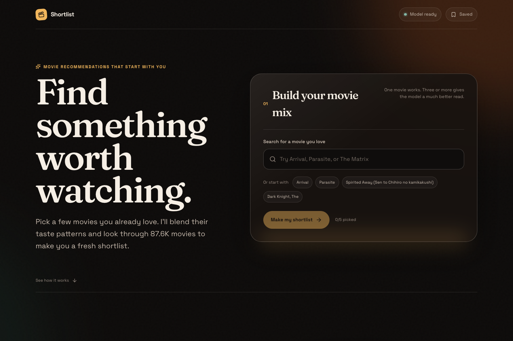

# Shortlist

A full movie discovery app built around one simple idea: pick a few movies you
already love and get a shortlist shaped by the overlap in your taste. The model,
Go API, and Next.js product all live in this repository.

[Try the live app](https://movie-reccomender-system-red.vercel.app) ·
[Read the case study](https://rohansingh04.com/projects/movie-recommender)

## What it does

- Builds a taste profile from one to five movies a visitor already loves
- Trains that exact favorite-movie mix to retrieve another movie the viewer liked
- Blends their learned item embeddings and searches the full catalog in one pass
- Recommends movies for an anonymous MovieLens viewer from their historical ratings
- Filters out movies that user already rated
- Searches by title and finds learned similar movies from a chosen starting point
- Adds TMDB genres, release details, ratings, overviews, and posters
- Returns natural reasons instead of exposing raw model scores
- Lets visitors save a shortlist locally, dismiss misses, open details, and ask for a fresh batch
- Serves the current live ranking path through a low-latency Go API

I built the data pipeline, models, API, and web app. On an untouched test cohort
of 7,060 future users, the live five-favorite flow reached 84.1% HitRate@10,
0.338 NDCG@10, and 0.331 Recall@100. The same popularity baseline reached 73.8%,
0.254, and 0.228. The stored-user retriever also reached 0.237 Recall@100 against
0.127 for popularity. In a 200-request local benchmark, known-user requests had
a 4.0 ms median and 5.6 ms p95 client round trip. The committed
[taste evaluation](docs/metrics/taste_eval_test.json),
[warm-user evaluation](docs/metrics/retrieval_eval.json), and
[latency results](docs/metrics/retrieval_latency.json) keep those claims
checkable.

## How it fits together

~~~text
MovieLens ratings + TMDB metadata
                |
                v
Python ML pipeline
  user-balanced training, warm-user retrieval, 1-to-5 favorite taste training
                |
                v
Verified serving bundle
  float16 user/movie vectors, seen-movie history, checksums
                |
                v
Go ranking API
  taste-vector blending, exact dot-product retrieval, search, explanations
                |
                v
Next.js app
  favorite picker, personal shortlist, details, saved movies
~~~

The public demo serves the learned retriever directly in Go. During training,
one objective learns stored viewer profiles while a second samples one to five
liked movies, averages them exactly as the product does, and predicts another
liked movie. New visitors therefore use a behavior the model was explicitly
trained for. The service keeps the taste profile temporary, excludes the chosen
movies, and searches the full catalog. No account or personal data is needed.

Known users get personalized candidates from the full 87,585-movie catalog,
with their training-window history removed. User-balanced batches stop highly
active viewers from dominating training, de-duplicated targets make each batch
more useful, and log-Q is calculated for the actual sampler. Movie search uses
the same learned item space for similarity. Users outside the trained vocabulary
fall back to the feature-table popularity heuristic. When a visitor seeds the
shortlist with a release too recent to have a trained embedding, the service
blends in a popularity prior in proportion to how cold the seeds are, so a brand
new movie returns well-liked films instead of noise while warm seeds stay fully
personalized. LightGBM reranking remains optional and is only used when
`MODEL_API_BASE` is configured.

## Run it locally

Requirements: Python 3, Go 1.21+, and Node.js 20.9+.

Install the Python dependencies:

~~~bash
python3 -m venv .venv
source .venv/bin/activate
pip install -r requirements.txt
~~~

The repository includes exported feature tables and the verified retrieval
bundle for the Go service.
Start the API:

~~~bash
cd service
go run ./cmd/server
~~~

In another terminal, start the site:

~~~bash
cd frontend
npm install
cp .env.example .env.local
npm run dev
~~~

Open [localhost:3000](http://localhost:3000). The frontend points to
`http://localhost:8080` by default.

## Rebuild the ML pipeline

The full sequence is available through the Makefile:

~~~bash
make ingest
make enrich
make features
make training
make train
make export
make train-retrieval
make metrics-retrieval
make metrics-taste
make train-serving
make export-retrieval
~~~

TMDB enrichment needs `TMDB_API_KEY`. MovieLens supplies the ratings, tags, and
movie identifiers; TMDB supplies the review-friendly metadata and posters.

To serve LightGBM scores locally, start the model service before the Go API:

~~~bash
uvicorn model_service.app:app --host 0.0.0.0 --port 8090
cd service
MODEL_API_BASE=http://localhost:8090 go run ./cmd/server
~~~

## Check the results

~~~bash
make metrics-eval
make metrics-compare
make metrics-retrieval
make metrics-taste
make metrics-scale
make metrics-latency
make test-service
cd frontend
npm run lint
npm run typecheck
npm run build
npm run test:e2e
~~~

The evaluation and serving paths stay separate on purpose. The product-aligned
test freezes the training cutoff, finds users with no pre-cutoff history, uses
their earliest one, three, or five future favorites as seeds, and treats their
later favorites as truth. Validation and test users are split deterministically,
and the test cohort is only used after model selection. Offline metrics show
whether the model learned something useful; the live app shows whether the full
system is understandable and fast enough to use. The bundle the app serves is
retrained on nearly the full timeline so recent releases have embeddings, while
the published metrics stay on the frozen holdout: evaluate on a holdout, deploy
on all the data.

## Main API routes

- `POST /rank` for user-based or movie-based recommendations
- `POST /rank` with `movie_ids` to build a temporary multi-movie taste profile
- `exclude_movie_ids` on rank requests to fetch genuinely fresh batches
- `GET /search?q=matrix&limit=10` for title search
- `GET /movie/{movie_id}` for movie details
- `GET /health` for service health

The live frontend is deployed on Vercel. The Go API is deployed separately so
the site and ranking service can scale and fail independently.

Every push now runs Go tests and vetting, Python exporter tests, frontend lint,
TypeScript, the production build, Playwright flows, mobile checks, and Axe
accessibility tests. A weekly workflow also checks the live Vercel and Render
deployments for health and stale product copy.
